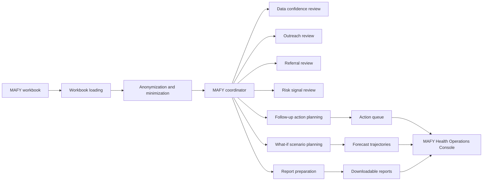

# MAFY Health Operations Console

MAFY is an AI-supported health operations console for AI4Good-style programme work in Madagascar. It turns an anonymized MAFY sensitisation workbook into practical guidance for outreach review, referral follow-up, data confidence, scenario planning, and shareable reporting.

The product is built around one principle: help field, programme, and M&E teams act on workbook evidence without pretending the dataset is clinical diagnosis data.

## Why MAFY Matters

Health organisations often hold valuable outreach and monitoring data in spreadsheets, but turning those rows into field decisions can be slow. MAFY gives teams a clear way to answer:

- Where did outreach reach the most people?
- Where do referral signals or referral gaps need review?
- Which areas combine workload, risk signals, and weak data confidence?
- What actions should field, M&E, and data teams review next?
- What may happen under a clearly labelled probabilistic planning scenario?

## Who MAFY Supports

| Audience | How MAFY Helps |
| --- | --- |
| Field coordinators | See which communes, sites, and activities may need follow-up first. |
| Healthcare specialists | Review referral activity, barrier signals, and high-risk participant-group indicators without losing the operational context. |
| M&E teams | Check coverage, data completeness, duplicate identifiers, GPS gaps, and confidence issues before reporting. |
| Programme leads | Compare outreach pressure, referral demand, and scenario forecasts in one place. |
| Partner organisations | Receive downloadable evidence packages for review, coordination, and presentation. |

## What MAFY Provides

| Capability | Value For Health Teams |
| --- | --- |
| Outreach visibility | Shows people reached, session activity, location mix, and field workload by site and area. |
| Referral review | Highlights referral activity, referral rates, and areas where high outreach but zero referrals may need confirmation. |
| Operational risk signals | Combines referral, barrier, participant-group, theme, and volume signals into area-level attention markers. |
| Follow-up action planning | Converts workbook evidence into assignable actions with owners, due windows, evidence, blockers, and rationale. |
| Scenario planning | Runs Monte Carlo what-if forecasts so teams can discuss possible future pressure under selected planning assumptions. |
| Data confidence checks | Flags missing GPS, duplicate identifiers, and completeness issues that can weaken interpretation. |
| Report package | Produces downloadable HTML, JSON, and CSV reports with charts, summaries, actions, and evidence tables. |
| Madagascar-first experience | Opens with a one-time 3D globe focused on Madagascar, then moves directly into the MAFY operations workspace. |

## How It Works



For the agent architecture, see [`docs/AGENTIC_INFRASTRUCTURE.md`](docs/AGENTIC_INFRASTRUCTURE.md).

## MAFY Workspace

| View | Purpose |
| --- | --- |
| Overview | Current reach, referral, quality, monthly activity, and priority summary. |
| Outreach | Outreach coverage, workload, and activity distribution. |
| Referrals | Referral follow-up signals and possible recording gaps. |
| Risk | Operational risk markers by site and commune. |
| Operations | Current follow-up actions, owners, blockers, and explainable rationale. |
| What-if | Monte Carlo planning forecasts with animated trajectory movement. |
| Reports | Shareable HTML, JSON, and CSV report downloads. |
| Quality | Data confidence issues that affect interpretation and follow-up reliability. |
| Scores | Transparent score components behind MAFY prioritisation. |

## Agentic Workflows

MAFY uses a coordinator and specialist agents for dataset review, follow-up planning, scenario forecasting, and report generation. Deterministic scoring remains grounded in the workbook. When `OPENAI_API_KEY` is configured, OpenAI is used for narrative support from anonymized aggregate payloads.

| Workflow | API Surface | Outcome |
| --- | --- | --- |
| Workbook summary | `GET /api/dataset/summary` | Metrics and chart-ready data for the MAFY workspace. |
| Follow-up operations | `POST /api/operations/follow-up` | Field-ready actions with evidence, owners, blockers, and rationale. |
| What-if planning | `POST /api/forecast/what-if` | Monte Carlo trajectories, movement frames, and scenario explanation. |
| Report package | `POST /api/reports/detailed` | Structured report payload for HTML, JSON, and CSV downloads. |
| Full agent review | `POST /api/agents/run` | Coordinator-run specialist outputs for deeper inspection. |

## Responsible AI Boundaries

MAFY is an M&E and operations assistant, not a clinical decision system.

- It does not diagnose patients.
- It does not infer confirmed disease burden.
- It does not replace local field review.
- It does not claim that Monte Carlo outcomes will happen.
- It supports prioritisation, explanation, data quality review, planning, and reporting.

The workbook does not contain patient-level facility visits, consultation timestamps, lab results, confirmed diagnoses, or health outcomes. MAFY therefore focuses on operational monitoring and planning support.

## Implementation Snapshot

| Layer | Role |
| --- | --- |
| `frontend/` | React, Vite, Tailwind CSS, Recharts, lucide-react, and Three.js MAFY workspace. |
| `backend/` | Bun service that loads the workbook, anonymizes sensitive fields, runs agent workflows, and serves structured payloads. |
| `data/` | Source workbook and generated anonymized outputs. |
| `docs/` | Architecture and operations documentation. |

## Getting Started

Install and run the MAFY agent service:

```bash
cd backend
bun install
bun run dev
```

Install and run the MAFY workspace:

```bash
cd frontend
npm install
npm run dev
```

Default local URLs:

```text
Workspace:     http://127.0.0.1:5173
Agent Service: http://127.0.0.1:8787
```

Local environment:

```text
PORT=8787
CORS_ORIGIN=http://127.0.0.1:5173
DATASET_PATH=../data/SENSIBILISATION_STAFFDFM_MAFY-2026-06-27.xlsx
OPENAI_API_KEY=your_key_here
OPENAI_MODEL=gpt-4.1-mini
```

Keep real keys in `backend/.env`. Do not commit secrets to `.env.example`.

## Validation

```bash
cd backend && bun run typecheck
cd frontend && npm run lint
cd frontend && npm run build
```

## Documentation

- [`docs/AGENTIC_INFRASTRUCTURE.md`](docs/AGENTIC_INFRASTRUCTURE.md): MAFY agent architecture, workflows, and diagrams.
- [`docs/OPERATIONS_OVERVIEW.md`](docs/OPERATIONS_OVERVIEW.md): brief workflow overview for the product.
- [`FOUR_DATA_USECASES.md`](FOUR_DATA_USECASES.md): dataset-grounded scoring and use-case definitions.
- [`backend/README.md`](backend/README.md): service commands, API routes, and anonymization notes.
- [`frontend/README.md`](frontend/README.md): workspace structure, commands, and integration notes.
