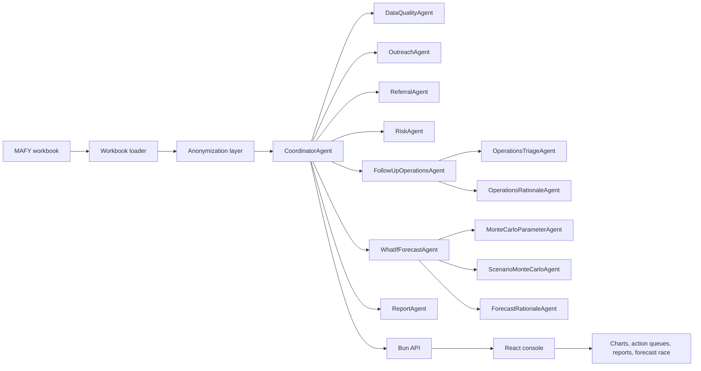

# MAFY Data Console

An AI-supported monitoring and evaluation console for Doctors for Madagascar. The project turns an anonymized MAFY sensitisation workbook into operational insight: outreach load, referral signals, data quality issues, follow-up actions, downloadable reports, and Monte Carlo what-if forecasts.

Built for an AI4Good Hackathon context, the goal is practical: help project, field, and M&E teams understand where attention is needed without pretending the dataset is clinical diagnosis data.

## Why It Matters

Doctors for Madagascar works with monitoring and evaluation data that can support project steering, reporting, quality improvement, research, and internal learning. Raw exports are useful, but reviewing them manually is slow and requires both technical skill and field context.

This console helps teams move from spreadsheet rows to action:

- Which communes or sites had the most outreach activity?
- Where are referrals recorded, and where might referral recording need review?
- Which areas combine outreach pressure, risk signals, and data quality issues?
- What follow-up actions should field, M&E, and data teams review next?
- What could happen under a clearly labelled probabilistic what-if scenario?

## Product Snapshot

| Layer | What it does |
| --- | --- |
| Frontend | Multi-page React console with charts, operations views, report downloads, what-if forecasting, and a one-time 3D Madagascar landing screen. |
| Backend | Bun API that loads the workbook, anonymizes sensitive fields, runs agent workflows, and returns structured operation/report/forecast payloads. |
| Agents | Coordinator plus specialist agents for data quality, outreach, referrals, risk, follow-up operations, reporting, and Monte Carlo what-if forecasting. |
| Dataset | `data/SENSIBILISATION_STAFFDFM_MAFY-2026-06-27.xlsx` |

## Architecture



For a focused agentic infrastructure view, see [`docs/AGENTIC_INFRASTRUCTURE.md`](docs/AGENTIC_INFRASTRUCTURE.md).

## Current Capabilities

| Capability | Description |
| --- | --- |
| Dataset summary | Live workbook metrics for participants, referrals, regions, sites, months, GPS gaps, and duplicate UID signals. |
| Operations actions | Assignable follow-up actions with owners, due windows, evidence, blockers, and optional rationale. |
| What-if forecasting | Seeded Monte Carlo scenario forecasts with animated trajectory and risk-pressure race views. |
| Report generation | Downloadable HTML, JSON, and CSV reports generated from backend report payloads. |
| Anonymization | Removes or minimizes direct identifiers before LLM-facing payloads or external export. |
| Landing experience | One-time Three.js globe focused on Madagascar, then the user enters the monitoring console. |

## Frontend Views

| View | Purpose |
| --- | --- |
| Overview | High-level reach, referral, quality, monthly activity, and priority score summary. |
| Outreach | Outreach load and geographic activity patterns. |
| Referrals | Referral score, referral rate, and referral gap signals. |
| Risk | Operational risk intensity by area. |
| Operations | Current backend-generated follow-up actions and rationale. |
| What-if | Monte Carlo scenario forecasts and animated pressure race. |
| Reports | Agent-generated downloadable HTML, JSON, and CSV reports. |
| Quality | Data issues that affect interpretation and follow-up reliability. |
| Scores | Score components and weighting logic. |

## Agentic Workflows

The backend runs deterministic dataset scoring for operational actions. If `OPENAI_API_KEY` is configured, LLM assistance is used for narrative rationale and report language from anonymized aggregate payloads.

| Workflow | Endpoint | Output |
| --- | --- | --- |
| Dataset summary | `GET /api/dataset/summary` | Workbook metrics and chart data. |
| Follow-up operations | `POST /api/operations/follow-up` | Field-ready actions with evidence and rationale. |
| What-if forecast | `POST /api/forecast/what-if` | Monte Carlo trajectories, race frames, and scenario explanation. |
| Detailed report | `POST /api/reports/detailed` | Structured report payload for HTML, JSON, and CSV downloads. |
| Full agent run | `POST /api/agents/run` | Coordinator-run specialist outputs. |

## Responsible AI Boundaries

This project does not make clinical diagnoses, patient-level triage decisions, or claims about confirmed disease burden.

The workbook does not contain patient-level facility visits, consultation timestamps, lab results, confirmed diagnoses, or health outcomes. The console therefore focuses on monitoring, operational prioritisation, data quality, scenario planning, and reporting support.

Monte Carlo what-if outputs are labelled as probabilistic planning aids. They are not guarantees and should be reviewed alongside field context.

## Project Structure

```text
backend/                 Bun API and agent workflows
data/                    Source workbook and generated anonymized outputs
docs/                    Architecture and operations documentation
frontend/                React/Vite/Tailwind console
FOUR_DATA_USECASES.md    Dataset-grounded scoring use cases
README.md                Hackathon-facing project overview
```

## Getting Started

Install and run the backend:

```bash
cd backend
bun install
bun run dev
```

Install and run the frontend:

```bash
cd frontend
npm install
npm run dev
```

Default local URLs:

```text
Frontend: http://127.0.0.1:5173
Backend:  http://127.0.0.1:8787
```

Optional backend environment:

```text
PORT=8787
CORS_ORIGIN=http://127.0.0.1:5173
DATASET_PATH=../data/SENSIBILISATION_STAFFDFM_MAFY-2026-06-27.xlsx
OPENAI_API_KEY=your_key_here
OPENAI_MODEL=gpt-4.1-mini
```

## Validation

Useful checks:

```bash
cd backend && bun run typecheck
cd frontend && npm run lint
cd frontend && npm run build
```

## Documentation

- [`docs/AGENTIC_INFRASTRUCTURE.md`](docs/AGENTIC_INFRASTRUCTURE.md): agent architecture, workflows, and Mermaid diagrams.
- [`docs/OPERATIONS_OVERVIEW.md`](docs/OPERATIONS_OVERVIEW.md): brief operations workflow overview.
- [`FOUR_DATA_USECASES.md`](FOUR_DATA_USECASES.md): dataset-grounded scoring and use-case definitions.
- [`backend/README.md`](backend/README.md): backend commands, API routes, and anonymization notes.
- [`frontend/README.md`](frontend/README.md): frontend structure, commands, and integration notes.
